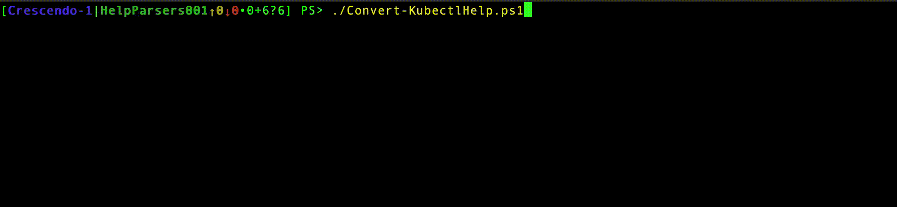

# Creating Configuration from Application Help

While Crescendo improves the experience of wrapping native executables,
there still may be substantial effort in completely wrapping a complex executable.
For example, for the `docker` command, there are more than 200 sub-commands,
each of which may have a large set of parameters that all need to be part of the configuration.
If it were possible to inspect the help of these complex commands and generate at least part of the
configurations, that would result in a large amount of time saved over constructing the configuration
individually via an authoring product such as Visual Studio Code (VS Code).

Because of the complexity of some commands, the help associated with those commands is naturally made
more regular and the way that help is accessed is also more regular.
If it were possible to scan this help for sub-commands and parameters and then use that scanned help
to generate Crescendo configurations, it may be possible to greatly accelerate wrapping these native commands.

In order to determine whether this was possible, I inspected the help of a number of the more complex native commands:

- Netsh
- kubectl
- docker
- winget
- Faas-cli (an extension to kubernetes  called `OpenFaas` )

I noticed, for the most part, that the help was regular for each of these tools but not consistent _across_ tools.
This gave me a bit of hope that I would be able to create a somewhat generalized parsing framework that I could change for each tool.

Underlying all of these parsers is the _assertion_ that while these tools will change over time with new features it's not likely that the _help_ format will change significantly.
This means that if the tools change, reparsing the help can discover new parameters and sub-commands enabling easier regeneration of the Crescendo configurations.
This way, it may be possible to keep the Crescendo configurations up to date with new revisions of the tools.

## Object Model Overlap

Crescendo has a very clear idea about its _internal_ object model.
That is, how Crescendo thinks what a command is, and its component parts and how it relates to the way advanced functions are created.
However, the help files that I saw didn't really match this very well.
For example, sometimes the help would provide a type for a parameter and other times it would not provide that information.
The help parsers have a stripped-down version of the Crescendo model that I use as a bridge from the help text to the objects that Crescendo uses.
The experimental help parsers all take the help, create reduced-set object model, and convert that into a Crescendo expression.
They aren't necessarily complete because the help doesn't always contain the needed information. So, the configurations they create will need tweaking.

> **_And About Crescendo's Object Model_** -
I felt the first thing that I needed to do was settle on an object model to express Crescendo configurations.
With the proper object model, I can make sure that I haven't left anything out.
PowerShell definitely has an object model for creating all the bits of a cmdlet,
but I wasn't interested in supporting _all_ the features of cmdlets and parameters,
so I edited the objects that we have to what I hope is their essence.

## Scanning Technique

I wanted to determine whether it was possible to have common code that could inspect the help and then recognize the command components.
Generally, the help for the tools I looked at makes a very clear distinction between the help for sub-commands and help for a specific operation.
This gave me hope that I would be able to at least generate the multiple commands for `docker` or `netsh.exe`.

### Architecture of the scanner

Because I wanted to reuse as much code as possible, I organized it as follows:

- An object model which is represents an intermediate state of a Crescendo configuration.
- A set of patterns that I could use to recognize the various elements in the help (usage, links, etc.)
- The help parser that uses the patterns to create instances of the types of the parser object model.
- A packager that takes all the parsed instances, converts them, and then creates the Crescendo configuration.

#### The Object Model

I chose to create a new object model for the help parser because I saw the process of parsing the help as a _staging_ step in creating the Crescendo configuration.
The Crescendo object is pretty rich and tries to handle a large set of scenarios.
However, the help of these applications doesn't provide for as much, especially as I was trying to create a more generic framework for scanning the help.
I saw the object model for the help as a trimmed down version of Crescendo, which, I hope, makes the actual mapping a bit easier.

#### The Patterns

This section tries to genericize the strings that I would be seeking.
Originally, I had hoped to create "one parser to rule them all", but that didn't work out.
However, my intent still lingers in this section.
The patterns are:

- the executable name and how to retrieve help (is it `-?`, `--help`, or something else)
- the pattern that designates that sub-commands will follow
- the pattern that designates that options will follow
- the pattern that designates that arguments will follow
- the pattern that designates that usage will follow
- the pattern that designates the actual parameter
- the pattern that designates additional help (on-line or other commands)

For the tools I've chosen so far, the help text is regular enough that when one of these strings is found,
we start hunting for the follow-on data to use.
For example, when the `Sub-Command` pattern is used, we start a loop that looks for new commands.
If we find a new command, we call the help parser and start the scan again for the new "command".

Each pattern represents elements that can be incorporated into the configuration.

#### Getting the Help Text

The scanner first starts with the help.
This means that the scanner has to know two things:

- the name of the executable
- the parameter used to get help

There was not much variation here, it was either `-?` and `--help` so each one of the parsers has something similar to:

```powershell
$exe = "docker"
$helpChar = "--help"
```

In order to start the parsing, I need to gather the first level help, so `& $exe $helpChar` is executed as part of the `parseHelp` function.

> **_It's a little more complicated than that_** - 
The function itself is recursive because I have to parse the help multiple times.
I search for sub-commands and, when found, I call the `parseHelp` function to add the new sub-command,
that parses the _new_ command before the original help is finished parsing.
Eventually, we run out of sub-commands so the help finally gets parsed.
But, if you notice the _order_ in which the parsed help objects are returned, they may not be the order you expect.

#### Parameter Recognition

Sometimes, the command argument has an associated type for the parameter and sometimes that information is not available.
This is why there are 2 patterns for a parameter:

```powershell
$parmPattern = "--(?<pname>[-\w]+)\s(?<ptype>\w+)\s+(?<phelp>.*)|--(?<pname>[-\w]+)\s+(?<phelp>.*)"
```

This pattern also ignores those patterns that are a single character.
I did this on purpose as PowerShell prefers parameters that are more descriptive.
I didn't create aliases out of those one-character parameters, which is something that could be done in the future.
I also don't handle the cases where the on- character parameter _follows_ the more verbose parameter.
In my inspection of the help, they all pretty much did something like:

```bash
	-q, --quiet     Do not be overly verbose
```

rather than:

```bash
	--quiet, -q     Do not be overly verbose
```

The regular expression which recognizes a parameter doesn't capture the first part where it is a single dash and letter `-q`.
Again, this is probably pretty easy to support.

Additionally, sometimes the usage statement declares a parameter.
For example:

```powershell
PS> docker run --help|select -first 4

Usage:  docker run [OPTIONS] IMAGE [COMMAND] [ARG...]

Run a command in a new container
```

This indicates that there is a _positional_ parameter `IMAGE` as well as an optional parameter `COMMAND`.
The current parsers don't handle this case (they need to be added manually to the configuration).
This is something I would like to address in the future.

> **options _and_ arguments?** -
Some of the tools have both named _and_ positional parameters, as well as options that apply to the _executable_ and the _command_.
For example: `docker --debug image list --all` has a parameter `--debug` that applies to the `docker` executable,
and `--all` that applies to the `image list` command.
These two elements are an attempt to manage these various conditions.
I'm not really satisfied with how I've done this, but haven't had time to tease apart the issues.
I plan on getting back to it eventually.

#### Usage Recognition

This seemed to have the greatest variability across the tools.
Sometimes the usage statement has a clear delineation:

```powershell
PS> docker --help | sls usage:  -NoEmphasis

Usage:  docker [OPTIONS] COMMAND
```

but sometimes this (with an extra line):

```powershell
PS> kubectl --help
...
Usage:
  kubectl [flags] [options]
```

or this (with _multiple_ extra lines):

```powershell
PS> faas-cli --help|select -first 10

Manage your OpenFaaS functions from the command line

Usage:
  faas-cli [flags]
  faas-cli [command]
```

or this (next to Usage: and the following line):

```powershell
PS> netsh -?
Usage: C:\windows\system32\netsh.exe [-a AliasFile] [-c Context] [-r RemoteMachine] [-u [DomainName\]UserName] [-p Password | *]
             [Command | -f ScriptFile]
```

There was so much variability I sort of hand-waved at this.
I want to get back to this to see if there's a one-size-fits-all parser,
but the current examples are not very successful here.

#### The Packager

Once the parsed help is separated into its components, we need a way to emit the Crescendo configuration.
I chose to make the parser object model be able to render the text that comprises the Crescendo configuration.
The parser command object has a method called `GetCrescendoCommand` that does the conversion from the parsers' object model to the Crescendo object model.
This makes the last mile of the problem the easiest, because the crescendo object _already_ knows how to build the JSON configuration.
Fortunately, we can rely on built-in features of .NET to do most of the work.
The only thing we need to do is to create an object which has the appearance of a configuration file:

```powershell
$h = [ordered]@{
    '$schema' = 'https://aka.ms/PowerShell/Crescendo/Schemas/2021-11'
    'Commands' = $commands
}
```

After that, it's a simple matter of using the JSON serializer to construct the configuration.
It _might_ be reasonable to emit the actual module,
but my expectation is that the configuration will need some tweaking so emitting the JSON is the better approach.
The parser takes the hashtable and some options and just calls the JSON serializer:

```powershell
System.Text.Json.JsonSerializer]::Serialize($h, $sOptions)
```

> **_And what about all that JSON_** -
As I was designing Crescendo, I wanted to be sure that the object model itself would be able to be expressed as configuration rather than code.
I knew that code would be needed for _some_ things, but I wanted to minimize how much code was required.
JSON, with its easy schema validation was a natural for this.
The schema can be annotated with tool-tips making the authoring process easier, as well as support for mandatory elements, types, enums, etc.
As I was investigating this, I did consider using PowerShell native hash-tables, but they simply lack these extra features.
Rather than spending my time adding these features to PowerShell, _which I heartily recommend someone undertake_,
I chose something that was ready to go.
I suppose I could have chosen `XML`...

## About these parsers

These help parsers are all "works in progress". They aren't finished products but rather something that can be used as a starting point.
For me, it was an investigation as to what may be possible and for some native tools (I'm looking at you `net.exe`) would not be much help.

## How to use the parsers

It should be possible to just run the parsers _if_ the tools that's being invoked is present.
The parsers don't check to be sure the executable is available.
The scripts all support two styles of execution.
Without any parameters, a hash-table of the schema and commands is returned.
This can be used to inspect the Crescendo command object.
If you use `-Generate` and `-File` it will create a Crescendo.json file which may be modified or passed to `Export-CrescendoModule` to create a module.
`-Force` is available to overwrite the file if you choose.
Here's an example:

```powershell
PS> $result = ./Convert-KubectlHelp.ps1
PS> $result.Commands | Format-Table | Select-Object -First 10
FunctionName                            OriginalName Description
------------                            ------------ -----------
Invoke-KubectlCreateClusterrole         kubectl      Create a ClusterRole.
Invoke-KubectlCreateClusterrolebinding  kubectl      Create a ClusterRoleBinding for a particular ClusterRole.
Invoke-KubectlCreateConfigmap           kubectl      Create a configmap based on a file, directory, or specified li…
Invoke-KubectlCreateCronjob             kubectl      Create a cronjob with the specified name.
Invoke-KubectlCreateDeployment          kubectl      Create a deployment with the specified name.
Invoke-KubectlCreateIngress             kubectl      Create an ingress with the specified name.
Invoke-KubectlCreateJob                 kubectl      Create a job with the specified name.
Invoke-KubectlCreateNamespace           kubectl      Create a namespace with the specified name.
Invoke-KubectlCreatePoddisruptionbudget kubectl      Create a pod disruption budget with the specified name, select…
Invoke-KubectlCreatePriorityclass       kubectl      Create a priorityclass with the specified name, value, globalD…
```

and a video:


